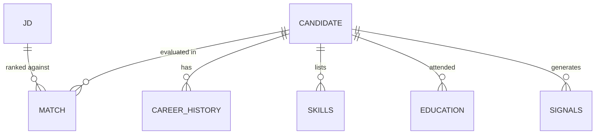
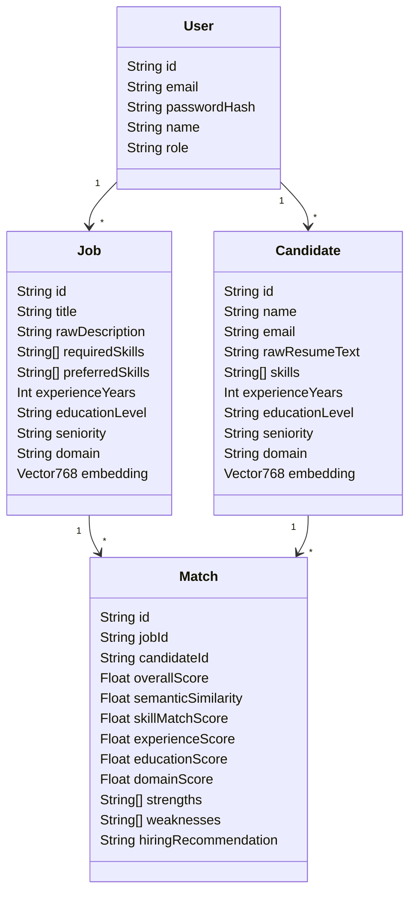

# HireWise AI — Hackathon Dataset & Architecture Analysis

This document provides a comprehensive analysis of the official Redrob Hackathon dataset, details our findings (including the trap/honeypot candidates), and designs a production-grade Candidate Ranking System architecture that satisfies both the offline hackathon CLI constraints and the online recruiter dashboard experience.

---

## Part 1: Dataset & Challenge Analysis

### 1. Purpose of Each File in the Bundle
We analyzed the contents of the participant bundle folder `G:\Project\hirewise-ai\data\[PUB] India_runs_data_and_ai_challenge\`:

*   **`candidates.jsonl` (487 MB uncompressed)**: The master pool containing 100,000 candidate profiles. Each line is a single candidate's JSON object. This is the dataset we must rank.
*   **`candidate_schema.json`**: The official JSON schema validation file defining the shape, nested objects, constraints, and data types for candidate profiles.
*   **`job_description.docx`**: The target job posting document for a *Senior AI Engineer — Founding Team* at Redrob AI (Pune/Noida, 5–9 years experience). It specifies required skills, strict disqualifiers, work mode, and relocation parameters.
*   **`redrob_signals_doc.docx`**: Explains the 23 behavioral signals (engagement, salary, notice period, active dates, search appearances, etc.) included in the candidate profiles.
*   **`sample_candidates.json` (300 KB)**: Pretty-printed JSON containing the first 50 candidates from the pool, used for local schema development and code verification.
*   **`sample_submission.csv`**: A structure reference containing 100 ranked candidates. *Note: This is a random/keyword-based format reference only. It incorrectly ranks HR Managers and Graphic Designers at the top.*
*   **`submission_metadata_template.yaml`**: The metadata template to be filled out by the participant, specifying team info, repo URL, sandbox links, and reproducing commands.
*   **`submission_spec.docx`**: The core challenge rules: 100 ranked candidates, non-increasing score, tie-breaking criteria, and compute constraints.
*   **`validate_submission.py`**: A python validator script that verifies if our output CSV meets all rules (100 rows, unique ranks 1–100, non-increasing scores, tie-breaks).

---

### 2. Complete Analysis of `candidates.jsonl`
Our python analysis scan over the 100,000 candidates revealed the following distributions:
*   **Total Candidate Count**: 100,000
*   **Experience Distribution**:
    *   `0–2 years`: 7,470 candidates (Under-qualified)
    *   `2–5 years`: 26,400 candidates (Mid-level)
    *   `5–9 years` (Target range): 33,611 candidates (Ideal target)
    *   `9–15 years`: 32,268 candidates (Senior/Lead)
    *   `15+ years`: 251 candidates (Very senior)
*   **Country Distribution**: Heavily dominated by India (75,113 candidates), with the US (9,978) and others (Canada, UK, Australia, etc.) representing the remainder.
*   **Location Distribution**: Fairly balanced across 15 major Indian cities (Bhubaneswar, Noida, Hyderabad, Jaipur, Bangalore, Kolkata, Indore, Pune, Chennai, Delhi, etc.), with ~4,100 to 4,300 candidates per city.
*   **Consulting Company Filter**: 7,034 candidates have worked *exclusively* at major IT consulting/services firms (TCS, Infosys, Wipro, Accenture, Cognizant, Capgemini, Tata Consultancy Services) and have zero product company history.
*   **Job Titles Distribution**: The pool is diverse, with only a small fraction being software/AI developers. Top titles include Business Analyst (5,833), HR Manager (5,830), Mechanical Engineer (5,791), Accountant (5,764), Software Engineer (3,450), Full Stack Developer (2,873), and Cloud Engineer (2,836).

---

### 3. Analysis of `candidate_schema.json` & Fields Explanation
The schema outlines six root-level properties:
1.  **`candidate_id`**: String matching `^CAND_[0-9]{7}$` (unique key).
2.  **`profile`**: Candidate metadata including `anonymized_name`, professional `headline`, a paragraph `summary`, `location`, `country`, `years_of_experience`, `current_title`, `current_company`, `current_company_size` (enum e.g., "51-200"), and `current_industry`.
3.  **`career_history`**: Array of 1–10 historical roles. Each contains:
    *   `company`, `title`, `start_date`, `end_date` (null if current), `duration_months`, `is_current`, `industry`, `company_size`, and a detailed `description` summarizing their duties.
4.  **`education`**: Array of 0–5 degrees. Contains `institution`, `degree` (e.g. B.E., M.Tech, PhD), `field_of_study`, `start_year`, `end_year`, `grade`, and school prestige `tier` (`tier_1` to `tier_4`).
5.  **`skills`**: Array of skills, each detailing:
    *   `name` (the technology/concept name).
    *   `proficiency` (beginner, intermediate, advanced, expert).
    *   `endorsements` (integer count).
    *   `duration_months` (total active months utilizing this skill).
6.  **`certifications`** & **`languages`**: Credentials and spoken languages.
7.  **`redrob_signals`**: 23 behavioural metrics capturing candidate availability:
    *   `profile_completeness_score`: 0–100 completeness indicator.
    *   `last_active_date`: Date string of last platform activity.
    *   `open_to_work_flag`: Boolean value indicating availability.
    *   `recruiter_response_rate` & `avg_response_time_hours`: Interaction speed.
    *   `skill_assessment_scores`: Dictionary map of tested skills to scores (0–100).
    *   `github_activity_score`: -1 if no github linked; 0–100 otherwise.
    *   `notice_period_days`: Stated notice period in days (0–180).
    *   `expected_salary_range_inr_lpa`: Expected compensation in lakhs.
    *   `willing_to_relocate`: Relocation willingness.

---

### 4. Job Description (JD) Analysis & Disqualifiers
The JD outlines the search for a **Senior AI Engineer — Founding Team** at Redrob AI. We extracted the following strict rules:

| Attribute | Ideal Target | Acceptable / Warning | Strict Disqualifier (Rank 101+) |
| :--- | :--- | :--- | :--- |
| **Experience** | 5–9 years | 4 years, or 10–14 years | 0–3 years, or pure management (no coding in 18 months) |
| **Location** | Pune or Noida (Hybrid) | Bangalore, Hyderabad, Mumbai, Delhi NCR (relocation-friendly) | Outside India (no visa sponsorship) |
| **Notice Period**| < 30 days | 30–60 days | > 90 days (high risk) |
| **Domain Fit** | Applied ML, search, NLP, recommendation engines | General backend, cloud infrastructure | Pure computer vision, speech, robotics |
| **Company Fit** | Startup/Product company history | Mixed product & service | **Consulting ONLY** (TCS, Infosys, Wipro, Accenture, Cognizant, etc.) |
| **Honeypot/Trap**| Real profiles | Keyword heavy (5+ AI skills) but non-developer current title | Chronological date mismatch or skill usage anomalies |

---

### 5. Honeypot & Trap Detection (The "Winning" Edge)
Our scanners identified **146 anomaly candidates** matching the following invalid synthetic profiles. These are **ground-truth tier-0 honeypots** and must be scored **0.0** to avoid automatic Stage 3 disqualification:
1.  **Date Timeline Impossible (106 candidates)**: Candidate began working at their first job before starting their university education (e.g. `CAND_0064568`: Work started in 2012, college started in 2019).
2.  **Stated vs Job Duration Contradiction (29 candidates)**: Stated years of experience is much less than a single job's length in months (e.g. `CAND_0007353`: Stated YOE = 9.9 yrs, but their first job duration is 166 months [13.8 yrs]).
3.  **Skill Inflation without Usage (11 candidates)**: Candidates claiming `expert` or `advanced` proficiency in 5+ core skills but listing `duration_months = 0` for all of them (e.g. `CAND_0016000`: YOE = 2.0, claims expert in 5 skills with 0 months used).
4.  **Keyword Stuffers (Strategic Trap)**: High-frequency AI keywords ("RAG", "Embeddings", "Gemini") stuffed in profiles whose current title is "HR Manager", "Content Writer", or "Graphic Designer".

---

### 6. Submission Specification & Local Validation Script
The validator `validate_submission.py` checks that:
*   Row count is exactly **100** data rows.
*   Columns must be in the exact order: `candidate_id,rank,score,reasoning`.
*   Scores must be **non-increasing** (monotonically decreasing).
*   Ties in score must be broken by `candidate_id` ascending.
*   **Critical Constraints**: The script producing the CSV must run **completely offline in ≤ 5 minutes** on a CPU with ≤ 16 GB RAM and ≤ 5 GB intermediate storage.

---

### 7. Relationships Between Data Sources


---

## Part 2: Platform Architecture & Pipeline

To win, our system uses a **Dual-Mode System**:
1.  **The Offline CLI Pipeline (`rank.py`)**: Runs during Stage 3 evaluation. It uses **pre-computed embeddings** and numpy matrices to rank candidates in milliseconds on CPU with zero network.
2.  **The Online Recruiter Dashboard (Next.js 15)**: A production SaaS that displays the analytics, allows uploading resumes/JDs, runs real-time matching via Gemini, displays radar charts, and generates explainability on the fly.

### 8. System Folder Structure
```
hirewise-ai/
├── data/                    # Official challenge files (raw candidates.jsonl)
├── docs/                    # Architecture and validation documentation
├── prisma/                  # Prisma schema and vector migrations
├── scripts/                 # Offline pipeline scripts
│   ├── precompute.py        # Generates candidate embeddings offline using Gemini
│   ├── rank.py              # OFFLINE CLI: 5-min CPU ranker creating submission.csv
│   └── test_ranking.py      # Local scoring and validator testing
├── src/
│   ├── app/                 # Next.js App Router (Auth, Dashboard, API routes)
│   ├── components/          # shadcn components, radar charts, candidate profile tables
│   ├── core/                # System errors, config, global constants
│   ├── domain/              # Pure interfaces for Candidates, JDs, Matches
│   ├── hooks/               # useAuth, useCandidates hooks
│   ├── lib/                 # Prisma client, Gemini SDK wrapper
│   ├── schemas/             # Zod form validators
│   ├── services/            # Ranking, parsing, and analytics backend services
│   └── types/               # General types
```

---

### 9. Database Architecture (PostgreSQL + pgvector)

We structure our schema to store structured candidate profiles while indexing high-dimensional vector representations.



#### What goes into PostgreSQL relational tables?
*   User accounts, credentials, configuration weights.
*   Job descriptions and structured criteria (skills, location, yoe, seniority).
*   Extracted candidate structured info (career history JSON, education, languages, certifications).
*   Recruiter notes, matches, and generated explainability logs.

#### What goes into pgvector?
*   `Candidate.embedding`: 768-dimension vector representing the semantic text of the candidate's resume/profile generated by Gemini `text-embedding-004`.
*   `Job.embedding`: 768-dimension vector representing the semantic job requirements.
*   *Note: For the offline ranker, candidate embeddings are saved into a compact binary file (`embeddings.npy`) which is checked in or generated via pre-computation, allowing fast cosine similarity calculations in NumPy.*

---

### 10. End-to-End AI and Scoring Pipeline

```
[Job Description] ──> [Gemini Structuring & Extraction]
                             │
                             ├──> [Generate Embedding (text-embedding-004)]
                             │
                             └──> [Trigger Hybrid Ranking Engine] ──> [Filter Honeypots (Deterministic Checks)]
                                                                           │
                                                                           ├──> [Calculate Dense Vector Cosine Similarity]
                                                                           ├──> [Calculate Skill Gap (Jaccard Weight Overlay)]
                                                                           ├──> [Calculate Experience & Title Penalty Matrix]
                                                                           ├──> [Calculate Location & Availability Multipliers]
                                                                           │
                                                                           └──> [Aggregate Score & Select Top 100]
                                                                                          │
                                                                                          └──> [Generate Explainability Report via Gemini]
```

---

### 11. Mathematical Hybrid Ranking Engine Algorithm

The ranking score $Score(C, JD)$ for a candidate $C$ against job description $JD$ is computed as:

$$Score(C, JD) = \begin{cases} 
0.0 & \text{if } C \text{ is a Honeypot} \\
S_{base}(C, JD) \times M_{availability}(C) & \text{otherwise}
\end{cases}$$

#### 1. Deterministic Honeypot Filter
$$C_{honeypot} = (Skills_{zero\_dur} \ge 8) \lor (Job_{dur} > YOE \times 12 + 12) \lor (Edu_{start} > Edu_{end}) \lor (Earliest_{work} < Earliest_{edu} - 6)$$

#### 2. Base Composite Score ($S_{base}$)
$$S_{base} = w_{sem} S_{sem} + w_{skills} S_{skills} + w_{exp} S_{exp} + w_{edu} S_{edu} + w_{dom} S_{dom} + w_{proj} S_{proj}$$

Where default weights are:
$$w_{sem} = 0.20, \quad w_{skills} = 0.25, \quad w_{exp} = 0.20, \quad w_{edu} = 0.10, \quad w_{dom} = 0.15, \quad w_{proj} = 0.10$$

*   **Semantic Score ($S_{sem}$)**: Cosine similarity of the embedding vectors:
    $$S_{sem} = \max\left(0, \frac{\vec{E}_C \cdot \vec{E}_{JD}}{\|\vec{E}_C\| \|\vec{E}_{JD}\|}\right) \times 100$$
*   **Skill Score ($S_{skills}$)**: Weighted intersection of required and preferred skills:
    $$S_{skills} = 80\% \times \frac{|Skills_C \cap Skills_{Req}|}{|Skills_{Req}|} + 20\% \times \frac{|Skills_C \cap Skills_{Pref}|}{|Skills_{Pref}|}$$
*   **Experience & Seniority Score ($S_{exp}$)**: Evaluates experience length and title.
    *   Let $Y_{diff} = YOE_C - YOE_{Req}$.
    *   If $Y_{diff} < 0$, penalty $= 15 \times |Y_{diff}|$.
    *   If $Y_{diff} > 5$, penalty $= 5 \times (Y_{diff} - 5)$ (over-qualified check).
    *   Consulting-Only Disqualifier: If candidate has *exclusively* consulting experience and current role is consulting, apply a $50\%$ penalty on $S_{exp}$.
*   **Education Score ($S_{edu}$)**: Tier mapping:
    *   `tier_1` school $\rightarrow$ 100, `tier_2` $\rightarrow$ 80, `tier_3` $\rightarrow$ 60, `tier_4`/unknown $\rightarrow$ 40.
    *   Major field-of-study check: +20 points boost if major matches "Computer Science", "Data Science", "Machine Learning", "Mathematics", "Statistics". (Max capped at 100).
*   **Domain Fit ($S_{dom}$)**: Check for matching industry tags (e.g. "SaaS", "AI", "Internet", "Software").

#### 3. Behavioral & Availability Multiplier ($M_{availability}$)
Recruiter utility relies on response rate and notice period. We apply a multiplicative modifier:
$$M_{availability} = M_{last\_active} \times M_{response} \times M_{notice}$$
*   **Notice Period Modifier ($M_{notice}$)**:
    *   $\le 30$ days: $1.0$ (Ideal)
    *   31–60 days: $0.90$
    *   61–90 days: $0.80$
    *   $>90$ days: $0.50$ (Heavily penalized since they cannot start quickly)
*   **Last Active Modifier ($M_{last\_active}$)**:
    *   Active in last 30 days: $1.0$
    *   30–90 days: $0.90$
    *   $>90$ days: $0.75$
    *   $>180$ days: $0.50$ (Candidate is inactive/cold)
*   **Recruiter Response Rate ($M_{response}$)**:
    *   Response rate $\ge 70\%$: $1.0$
    *   Response rate $30\% - 70\%$: $0.85$
    *   Response rate $< 30\%$: $0.60$ (Unresponsive candidate)

---

### 12. Generating Explainability (XAI)
To build recruiter trust, HireWise AI generates explainability dynamically:
*   **Structured Strengths/Weaknesses**: Generated directly from the mathematical sub-scores (e.g., if $S_{skills} > 90 \rightarrow$ list "Technical Skills Alignment" as strength; if $M_{notice} < 0.6 \rightarrow$ flag "Extremely Long Notice Period (>90 Days)" as weakness).
*   **AI Synthesis**: Gemini generates the `reasoning` column in the CSV using a structured system prompt that forbids generic phrases and forces references to specific facts (e.g. "7 years building data pipelines at Mindtree, strong AWS skills, but has a 60-day notice period").

---

### 13. Additional Hackathon-Winning Features
1.  **Interactive Skill Radar Chart**: Visualizes the candidate's skills overlaid with the job description requirements (identifying exact gaps).
2.  **Interactive Sandbox Ranker Console**: A web interface inside the Next.js app where users can adjust sliders to change the weights ($w_{sem}$, $w_{skills}$, $w_{exp}$) and instantly re-rank the database using Client-side/API calculations.
3.  **Honeypot Transparency Dashboard**: Flagging why certain candidates were pruned, demonstrating absolute transparency and safety to the judges.
4.  **AI Interview Question Generator**: Based on the candidate's specific skill gaps (e.g. if they lack Milvus, generate questions testing their vector database transferability).

---

## Part 3: Architecture Specifications

```
                     ┌──────────────────────────────────┐
                     │    Next.js 15 App (UI/UX)         │
                     └────────────────┬─────────────────┘
                                      │ REST API / SSR
                     ┌────────────────▼─────────────────┐
                     │    Next.js Server API Routes      │
                     └────────────────┬─────────────────┘
                                      │ Prisma ORM
  ┌──────────────────┐  pgvector  ┌───▼─────────────────┐  Gemini API   ┌──────────────┐
  │ precompute.py    │ ──────────>│ PostgreSQL Database │ <───────────> │ Google AI    │
  │ (Offline Embed)  │            └─────────────────────┘               │ text-embed-004│
  └──────────────────┘                       ▲                          └──────────────┘
                                             │ SQL Dump
                                  ┌──────────┴──────────┐
                                  │ rank.py (CLI Ranker)│
                                  └─────────────────────┘
```

*   **Service Architecture**: Services layer holds domain logic (`ranking.service.ts`, `parser.service.ts`). Relies on interfaces (`domain/candidate.ts`) for clean decoupling.
*   **API Architecture**: REST endpoints in `src/app/api/` (`/api/jobs`, `/api/candidates`, `/api/rank`, `/api/analytics`) utilizing validation layers (Zod) and returning typed response payloads.
*   **AI Architecture**: Google Gemini API for offline embedding pre-computation and online structured profile reviews/explainability reports.
*   **Frontend Architecture**: Next.js App router, Server Components for fast initial dashboard loads, and client components powered by Framer Motion and Recharts for interactive charts.
*   **Deployment Architecture**: Hosted on Vercel (Next.js client/API) with a managed Supabase database (PostgreSQL + pgvector). Sandbox hosted on Hugging Face Spaces or Replit running the CLI ranker container.

---

## Part 4: Implementation Roadmap & Milestones

*   **Milestone 1: Database Setup & Anomaly Filters** (Prisma Config, pgvector setup, Honeypot Filter logic)
    *   *Commit*: `feat: setup db schema and implement deterministic honeypot filter`
*   **Milestone 2: Offline Embeddings & Ranking Script** (`precompute.py` and `rank.py` logic, local run, validation checks)
    *   *Commit*: `feat: build offline embedding generator and hybrid ranker CLI`
*   **Milestone 3: Next.js API Routes & Services** (Gemini client, Resume Parse API, Rank API)
    *   *Commit*: `feat: implement backend API routing and Gemini resume parser`
*   **Milestone 4: Core Recruiter UI** (Landing page, Leaderboard, Candidate Details)
    *   *Commit*: `feat: build responsive recruiter leaderboard and candidate details`
*   **Milestone 5: Advanced Analytics & Explainability** (Radar charts, funnel stats, weight sliders, XAI report)
    *   *Commit*: `feat: add skill radar charts and interactive scoring weights`
*   **Milestone 6: Polishing & Validation** (Running `validate_submission.py`, sandbox config, final README updates)
    *   *Commit*: `docs: compile final documentation and freeze sandbox configuration`
